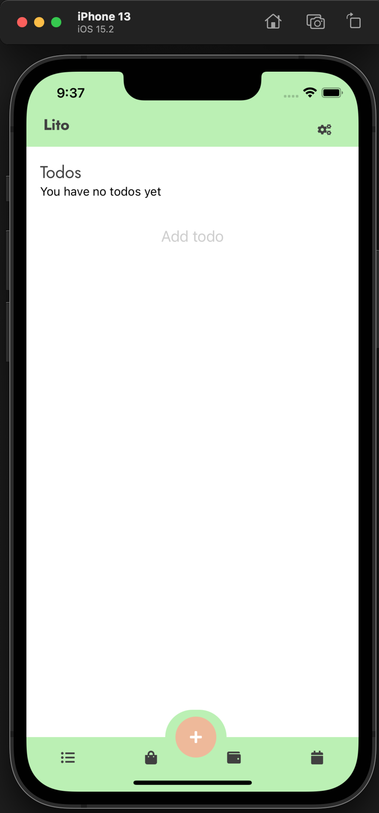

# lito (Living together)

React native app for managing a household together (grocery shopping list, expenses overview, todos, cleaning plans...)

## How to start

```shell
yarn ios
yarn android
```

## Todos

### Frontend

- Action buttons => buttons to show after hitting the addButton to add a list, listItem, expenses or something planned which triggers the different modals
- Action modals in iOS style
- Lists for todos
- Styling lists and todos
- Expenses part 1:
  - add items splitwise like
  - show current balance (negative or positive)
- Expeneses part 2: current account balance with connection to the open banking api (psd2 - dkb) and latest spendings with labels, potentially you can look at charts to figure out where you spend your money on
- Planner:
  - show planner and agenda in views
- Settings:

  - Dark mode (use system or own settings)
  - Invite friends (how and where is that managed)
  - ToS
  - App version

- Add animations and better styling

### Backend

- Graphql API
- PostgreSQL
- Authentication (with groups)
  Where to host and which technologies to use

### Tests

- setup + components

## Images


